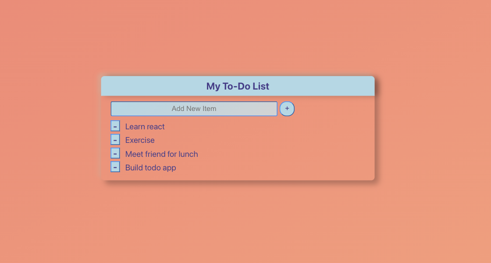

# TodoList-React
Todo List created in React

This is the code for a basic TODO list made with React. It originated from an assignment in Week #14 of MIT's MERN Coding Bootcamp. The challenge was to refactor out components, personalize features, and add styling.

<h2>Features</h2>
<ol>
<li>React useState is used to maintain state of the list and input values for new items.</li>
<li>Buttons were added to remove and add items to the list.</li>
<li>Two color shadow boxes and gradients were used to give an Neurmorphic look to the form and buttons.</li>
<li>Components were refactored to an input form, list item, header, and plus and minus buttons</li>
</ol>

<h2>To see the form in action follow this link:</h2>
<a href="https://codesandbox.io/s/todolist-react-xzfqo?file=/src/App.js:0-1026">Link to CodeSandbox</a>
<h2>To use:</h2>
<ul>
<li>Fork this repository</li>
<li>Clone copy to your desktop</li>
<li>Open a command line on your computer and run the command cd path/to/project/root. (path/to/project/root should be replaced with the actual path to the project folder)</li>
<li>Within the same command-line window, run 'npm install' to install all dependencies.</li>
<li>Within the same command-line window, run 'npm start' to start the application in your browser.</li>
  </ul>
<h2>Contributors</h2>
<ul>
  <li>Bill Conley</li>
  <li>Dr. Abel Sanchez</li>
 </ul>
<h2>License</h2>

Copyright (c) 2021 Bill Conley

Permission is hereby granted, free of charge, to any person obtaining a copy
of this software and associated documentation files (the "Software"), to deal
in the Software without restriction, including without limitation the rights
to use, copy, modify, merge, publish, distribute, sublicense, and/or sell
copies of the Software, and to permit persons to whom the Software is
furnished to do so, subject to the following conditions:

The above copyright notice and this permission notice shall be included in all
copies or substantial portions of the Software. 

THE SOFTWARE IS PROVIDED "AS IS", WITHOUT WARRANTY OF ANY KIND, EXPRESS OR
IMPLIED, INCLUDING BUT NOT LIMITED TO THE WARRANTIES OF MERCHANTABILITY,
FITNESS FOR A PARTICULAR PURPOSE AND NONINFRINGEMENT. IN NO EVENT SHALL THE
AUTHORS OR COPYRIGHT HOLDERS BE LIABLE FOR ANY CLAIM, DAMAGES OR OTHER
LIABILITY, WHETHER IN AN ACTION OF CONTRACT, TORT OR OTHERWISE, ARISING FROM,
OUT OF OR IN CONNECTION WITH THE SOFTWARE OR THE USE OR OTHER DEALINGS IN THE
SOFTWARE.

